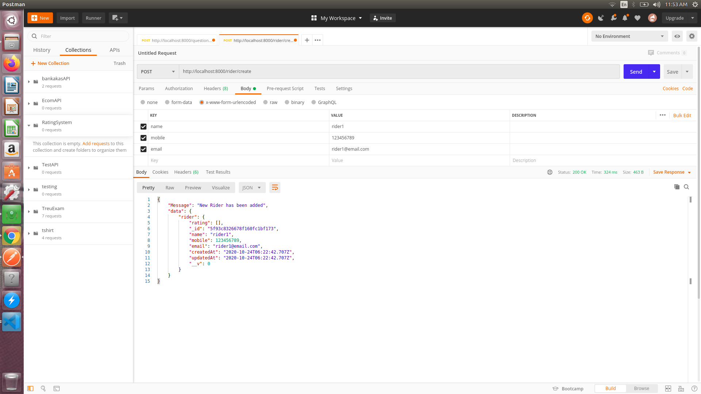
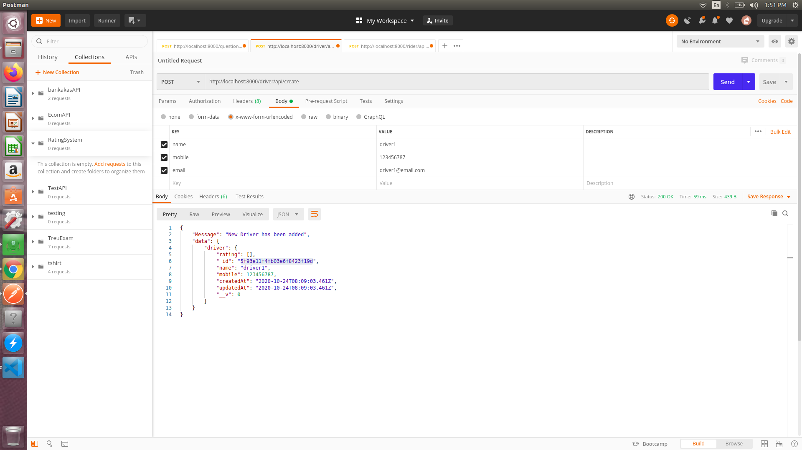
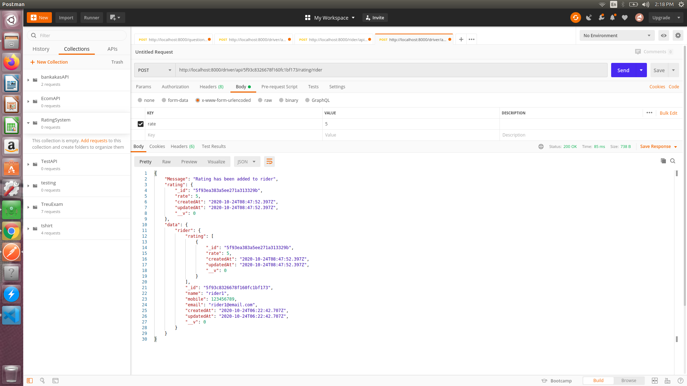
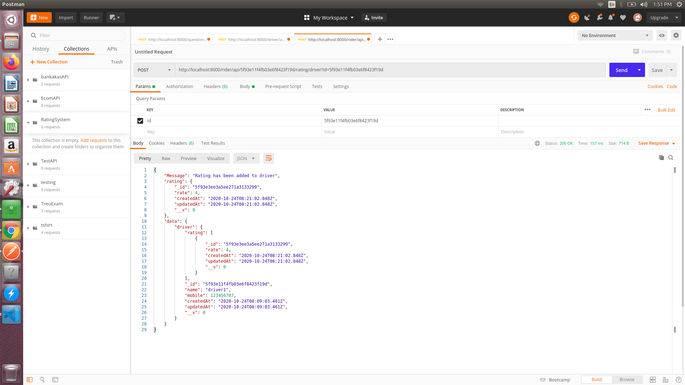
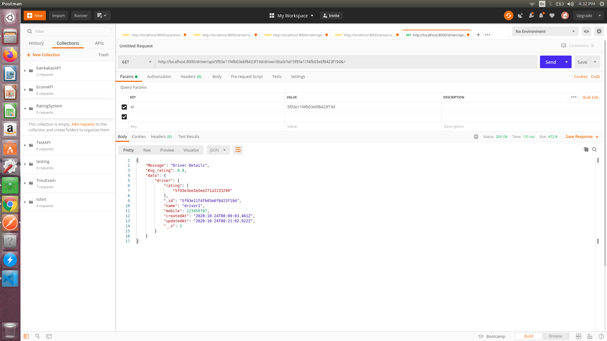
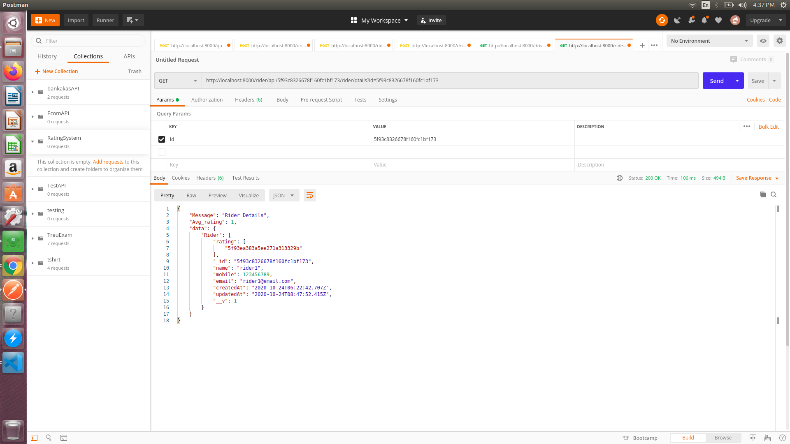

# RatingAppSystem
Oye! Rickshaw | to design and implement the backend of a rating service

# The solution supports | Tasks
1. The passenger should be able to rate a given ride.
2. The driver should be able to see aggregated rating of his all rides
3. The driver should be able to rate the passenger after ride
4. The passenger should be able to see his aggregated rating based on all the rides he has
taken.

# TechStack:
1. node.js
2. express.js
3. restful api
4. postman used for requests
s
# Steps:

  1.) Create the Rider
    URL: http://localhost:8000/rider/api/create
    
  2.) Create the Driver
    URL: http://localhost:8000/driver/api/create
    
  3.) Rating added to rider
    URL: http://localhost:8000/driver/api/:id/rating/rider?id=riderId?
    
  4.) Rating addedd to driver
    URL:http://localhost:8000/rider/api/:id/rating/driver?id=driverId?
    
  5.) Driver Details
    URL:http://localhost:8000/driver/api/:id/driver/dtails?id=driverId?
    
  6.) Rider Details
    URL: http://localhost:8000/rider/api/:id/rider/dtails?id=riderId?
    
  
# Steps to run application | Terminal Commands:
1. clone it
2. open this folder on teminal
3. npm install 
4. npm start
  
# Note:
1. I have completed the assignment as per the given instructions which fullfill all the rquirements.
2. I completed this assignement as per the standard format of scalabe project.
3. challenging thing for me only, when i was thinking the designed part of the product and i did it just take a few time. 
